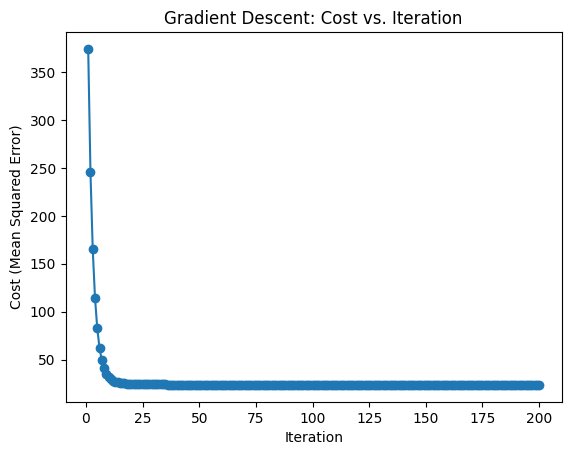

# Linear Regression Optimization using Gradient Descent

## Objective

The objective of this project is to implement and optimize a linear regression model using the gradient descent algorithm. The script is designed to load training and test datasets from CSV files, perform gradient descent optimization, make predictions on the test data, and save the results to a CSV file. Additionally, a visualization of the cost (mean squared error) over iterations is provided to showcase the optimization process.

## Implementation

### Requirements

- Python 3
- NumPy
- Matplotlib (for visualization)

### Usage

1. **Install Dependencies:**
    ```bash
    pip install numpy matplotlib
    ```

2. **Run the Script:**
    ```bash
    python generic_gradient.py
    ```

### Code Structure

- **`linear_regression.py`:**
    - `step(data, learning_rate, theta)`: Performs one step of gradient descent.
    - `cost(data, theta)`: Calculates the mean squared error (cost) given the data and parameter values.
    - `gradient_descent(data, learning_rate, iterations)`: Performs gradient descent for a specified number of iterations.
    - `run(data)`: Sets hyperparameters, calls gradient descent, and returns the final parameters.
    
    The script also includes code to prepare test data for prediction and saves the predicted values to a CSV file.

### Results

- **Cost vs. Iteration Plot:**
    - A plot is generated showing how the cost decreases with each iteration during the gradient descent process. This provides insight into the optimization progress.


